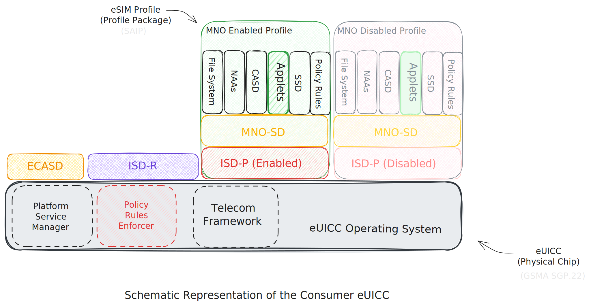

# STK2ETH JavaCard Applet Specifications



## Trusted Execution Environment
|Component| Function|
|---------|-------------------------|
|`eUICCs` |  Hardware root of trust.|
|`Java Card VM` | Isolated execution environment.|

We leverages the eUICCs as a hardware root of trust, operating within the isolated execution environment of the Java Card VM, effectively creating a Trusted Execution Environment (TEE).

This secure, isolated compute environment guarantees:
  - Confidentiality: 
      - Private keys cannot be read externally.
      - No seed phrases.
      - Keys are generated and stored exclusively within the eUICC Secure Element, ensuring they never leave.
  - Integrity: 
      - Code execution is tamper-proof.
      - Ensured by the combination of the Attested Java Card VM, eUICC and ERC-4337 wallet.
  - Attestation: 
      - Proof of execution in a trusted environment.
      - Transactions are signed exclusively within the Java Card VM.

<br>

This design enables a non-custodial, optimally secure, seedless ERC-4337 mobile wallet by using eSIM Profiles as Trusted Execution Environments (TEE).
It’s highly inspired by Daimo’s and Taisys' models, combining and extending them by leveraging eUICC secure enclaves operating within the isolated execution environment of the Java Card VM for key generation, signing and attestation.


## Private Key Generation and Storage
No seed phrases. Keys are generated and stored `exclusively` within the eUICC Secure Element, ensuring they never leave.


### Must 
1. Keys are generated `exclusively` within the Java Card VM (isolated execution environment).
2. Keys are stored `exclusively` within the eUICC Secure Element ( hardware root of trust )
3. No seed phrases - keys never leave the Secure Element.
4. Keys cannot be read external of applet's Java Card VM (isolated execution environment)
5. Java Card VM Default exclusive:
      - Access Policy is by default exclusive to the applet signature
      - 2 applets by default cannot share the same signature
      - All is erased when applet is erased

### Key Derivation
Uses `SECP236r1`(P-256) with future support for Ed25519. Follows `m/44'/60'/0'/0/x` derivation path (BIP-32,BIP-44 compliant).

- secp256k1 : [BTC/ETH]
- secp256r1: Rest of world  (our default)

| Curve			| Blockchain Use		|		Non-Blockchain Use		|	Security Level	|	Java Card Support |
|-----------|-------------------|-------------------------|-----------------|-------------------|
|secp256k1	|	Bitcoin, Ethereum	|		Rare outside blockchain|			128-bit		|	❌ No official support
|secp256r1 (P-256)	|XRP, Hedera				|TLS, Passkeys, Apple, Google, FIDO2|	128-bit			| ✅ Yes
|Ed25519			|Monero, Solana, NEAR, Polkadot|		SSH, Signal, Tor, WebAuthn|		128-bit			| ✅ Yes
|Ed448			|Limited					|FIDO2, Post-Quantum Research|		224-bit			| ✅ Yes


<!-- R1: [ DeepSeek, P-256, Yamaha, PlayStation ] #M1 -->

#### Summary

| Step		|	Action |
|---------|--------|
|🔹 No Seed Phrase	|Keys stored inside Secure Enclave, generated securely|
|🔹 BIP-32 secp256r1	|Follow m/44'/60'/0'/0/x derivation|
|🔹 Ethereum Address|	Compute from secp256r1 public key → keccak256 → EIP-55|
|🔹 MetaMask Import|	Document path for future R1 support|
|🔹 Security		|Private keys never leave enclave|


## UserOp Signing
Transactions are signed `exclusively` within the Java Card VM (isolated execution environment) using the Generated Key.


## Text-Based User Interface (STK Menu)
STK Menu implements a Text-Based User Interface for:

1. Send ETH
2. Swap
3. Withdraw Cash
4. Buy Airtime
5. My Account
6. Check Balance


```JSON
{

"MainScreen": {
			"text": "M-ETH Main Menu",
			"screen_type": "Menu",
			"default_next_screen": "DefaultNoneScreen",
			"menu_items": {
				"SendETHOption": {
					"option": "1",
					"display_name": "Send ETH",
					"next_screen": "SendETHScreen"
				},
                        "SwapOption": {
                              "option": "2",
					"display_name": "Swap",
					"next_screen": "SwapScreen"
				},
                        "WithdrawOption": {
					"option": "3",
					"display_name": "Withdraw Cash",
					"next_screen": "WithdrawScreen"
				},
			      "AirtimeOption": {
					"option": "4",
					"display_name": "Buy Airtime",
					"next_screen": "AirtimeScreen"
				},
                        "AccountOption": {
					"option": "5",
					"display_name": "My Account",
					"next_screen": "AccountScreen"
				},
                        "BalanceOption": {
					"option": "6",
					"display_name": "Balance",
					"next_screen": "BalanceScreen"
				},
			}
		},
}
```
## USSD Submission
TODO
